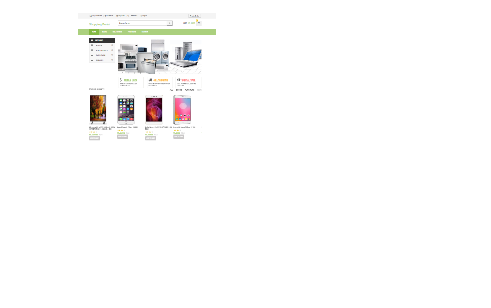

# Shop.com
E-commerce means any transaction over the internet.
In online marketing, a shopping cart is a piece of e-commerce software on a web server that allows visitors to an Internet site to select items for eventual purchase, analogous to the American English term “shopping cart.” In British English, it is generally known as a shopping basket, almost exclusively shortened on websites to “basket.”
The software allows online shopping customers to accumulate a list of items for purchase, described metaphorically as “placing items in the shopping cart” or “add to cart.” Upon checkout, the software typically calculates a total for the order, including shipping and handling (i.e., postage and packing) charges and the associated taxes, as applicable.

User Registration
User login system
Change password
Forgot password
Profile management sytem.
Shopping cart
Wishlist
Order History

Product Management(Add,Update, Delete)
Order Management System
User Management
Category/ Sub Category Creation and many more

HTML
CSS
PHP
MYSQL
JAVASCRIPT
JQUERY

XMPP

